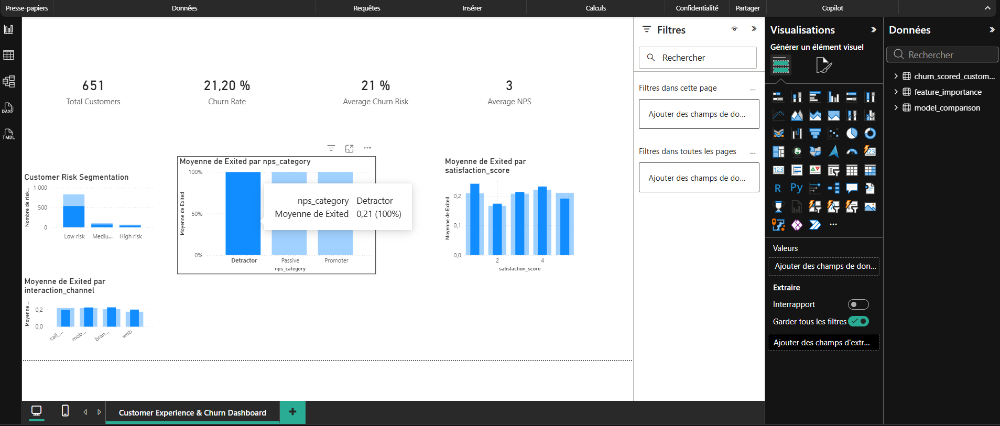

# Customer Experience & Churn Dashboard

## Overview

This dashboard translates the outputs of the churn prediction model into **business insights** that help understand the relationship between customer experience and churn risk.

It combines customer attributes, experience indicators and predictive scores to provide a clear view of retention dynamics.

The dashboard was designed as a **decision-support tool** that could be used by customer experience, marketing or strategy teams to identify the main drivers of churn and prioritize retention actions.

---

# Dashboard Objectives

The dashboard focuses on three main objectives:

- understand the overall churn level within the customer base
- identify high-risk customer segments
- analyze how customer experience indicators influence churn behavior

By combining predictive analytics with business indicators, the dashboard provides actionable insights for improving customer retention.

---

# Key Performance Indicators

The top section of the dashboard presents four key metrics that summarize the global customer situation.

### Total Customers

Displays the total number of customers included in the dataset.

This metric provides the overall population size used for the analysis.

---

### Churn Rate

Represents the percentage of customers who left the service.

This indicator measures the overall retention performance and helps evaluate the scale of the churn problem.

---

### Average Churn Risk

Shows the average predicted churn probability generated by the machine learning model.

This value provides an estimate of the overall churn exposure within the customer base.

---

### Average NPS

Displays the average Net Promoter Score across customers.

NPS is widely used as a proxy for customer loyalty and satisfaction.

Lower scores typically indicate weaker customer engagement and a higher likelihood of churn.

---

# Customer Risk Segmentation

This visualization presents the distribution of customers across three predicted risk levels:

- Low Risk
- Medium Risk
- High Risk

The segmentation is derived from the churn probability predicted by the machine learning model.

This allows business teams to quickly identify the proportion of customers who may require proactive retention actions.

For example, high-risk customers could be targeted with personalized retention campaigns.

---

# Churn Rate by NPS Category

This visualization highlights the relationship between customer loyalty and churn behavior.

Customers are grouped into three NPS categories:

- **Detractors**
- **Passives**
- **Promoters**

The chart displays the average churn rate for each category.

This analysis helps illustrate how customer perception of the service impacts retention outcomes.

Typically, detractors exhibit significantly higher churn rates than promoters.

---

# Churn Rate by Satisfaction Score

This chart shows how churn behavior varies according to customer satisfaction levels.

Lower satisfaction scores are often associated with higher churn rates.

This visualization helps identify the impact of service quality and customer experience on retention.

Such insights can guide initiatives aimed at improving service quality and customer support.

---

# Churn Rate by Interaction Channel

This visualization analyzes churn behavior depending on the interaction channel used by the customer.

Examples of channels include:

- call center
- mobile application
- web platform
- branch interactions

Understanding which channels are associated with higher churn rates can help organizations improve customer journeys and optimize service channels.

---

# Business Insights

The dashboard highlights several key insights regarding customer retention dynamics.

First, churn is not evenly distributed across the customer base. Certain segments exhibit significantly higher churn risk.

Second, customer experience indicators such as NPS and satisfaction scores are strongly associated with churn behavior.

Finally, interaction channels may influence customer engagement and retention outcomes.

These insights demonstrate how combining predictive models with customer experience indicators can help organizations better understand and anticipate churn patterns.

---

# Business Value

This dashboard demonstrates how machine learning outputs can be translated into **clear and actionable business insights**.

It supports several types of strategic decisions, including:

- identifying high-risk customer segments
- prioritizing retention campaigns
- improving customer experience initiatives
- optimizing service channels

By transforming analytical outputs into intuitive visual insights, the dashboard helps bridge the gap between **data science and business decision-making**.

---

# How to Open the Dashboard

The dashboard can be opened using **Power BI Desktop**.

The file is located at:
dashboard/customer_experience_dashboard.pbix

Once opened in Power BI Desktop, users can interact with the visualizations and explore the different customer segments.

---

# Project Context

This dashboard is part of a broader **Customer Experience Intelligence project** that combines:

- customer data analysis
- natural language processing of customer complaints
- churn prediction modeling
- model deployment using FastAPI
- business visualization with Power BI

The goal of the project is to demonstrate how advanced analytics and machine learning can support customer experience strategy and retention optimization.